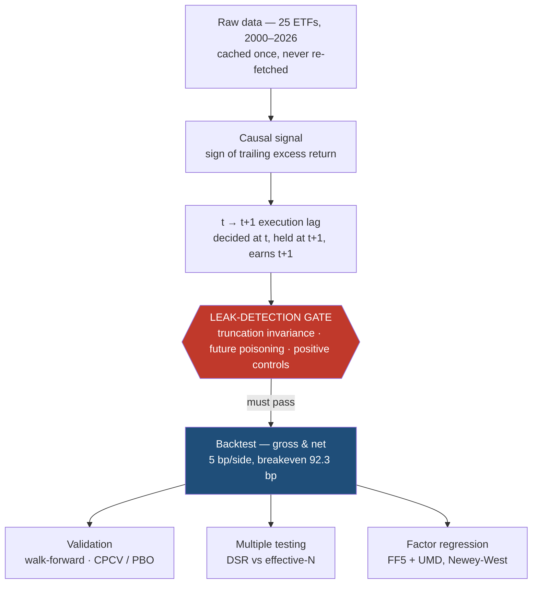
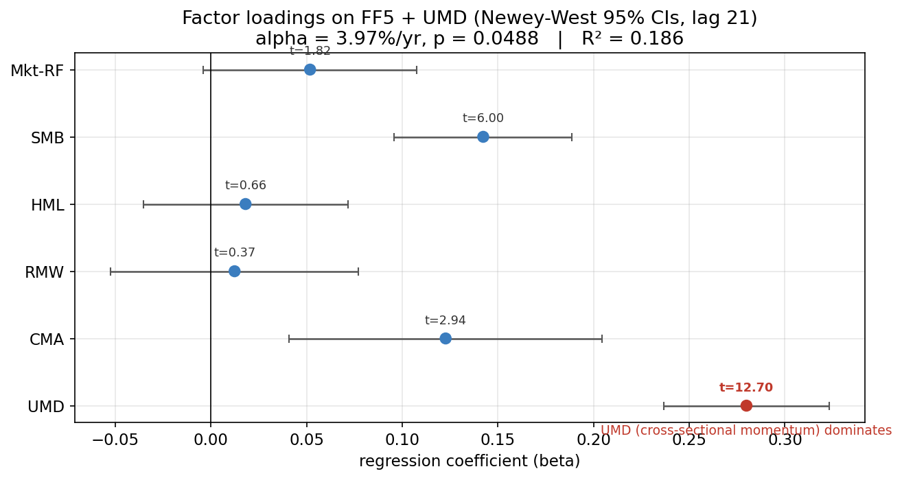
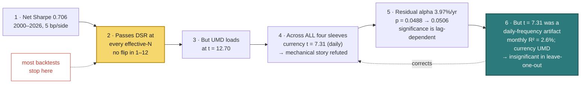
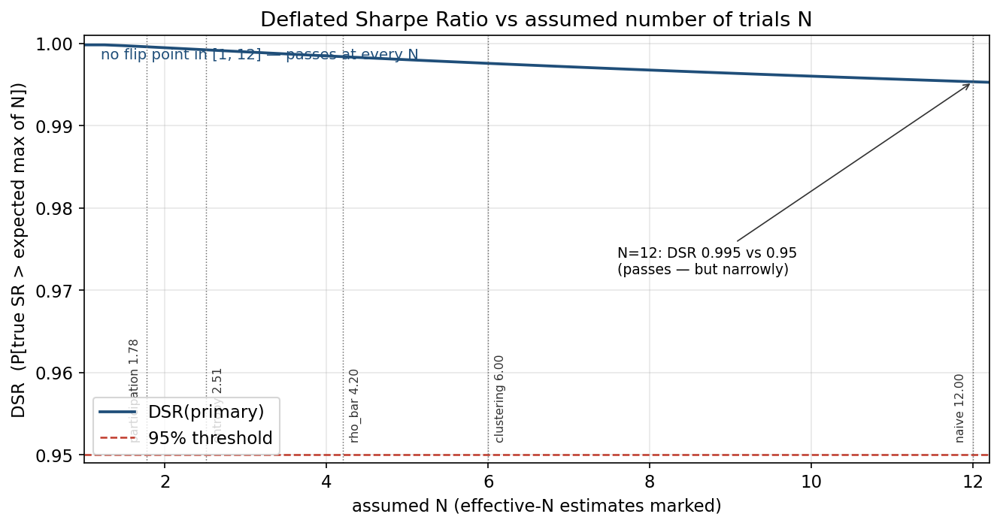
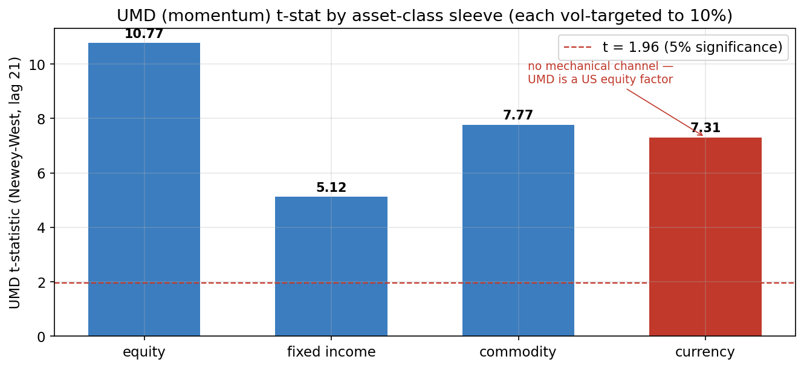
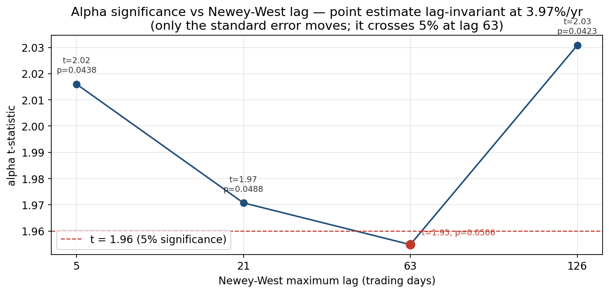
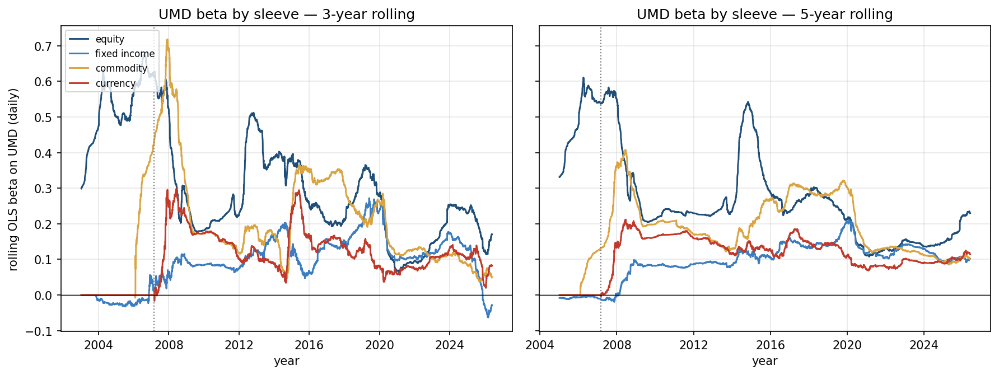
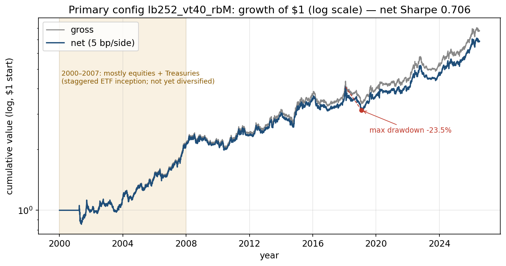
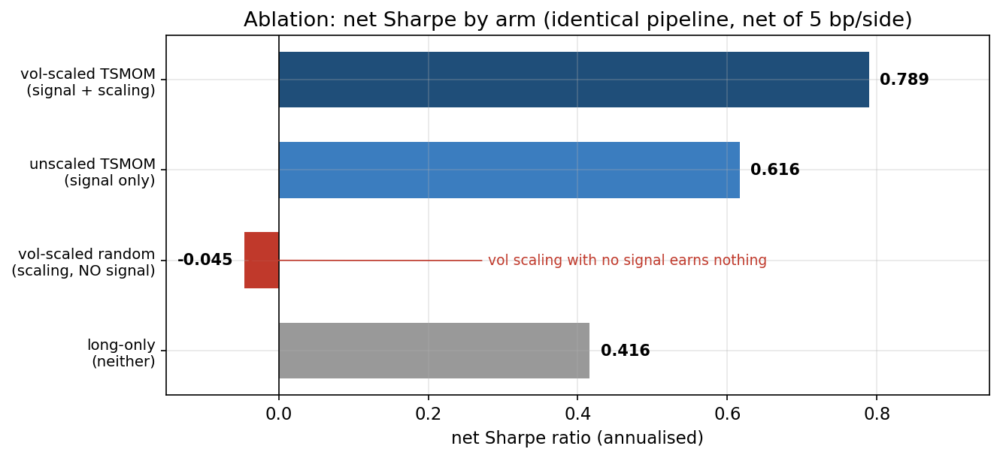
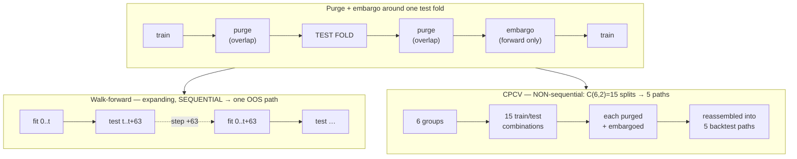

# Time-Series Momentum, Tested Honestly

*A pre-registered time-series momentum replication on 25 liquid ETFs (2000–2026), and what
happened when it was subjected to the corrections most backtests skip.*

> **Net Sharpe 0.706** (2000–2026, 25 ETFs, net of 5 bp/side).
> It passes the Deflated Sharpe Ratio at **every** effective-N accounting tested (N = 1.8 to 12;
> no flip point in range).
> **It also carries a real cross-sectional-momentum (UMD) exposure** — UMD explains ~**12% of
> the portfolio's monthly variance** (the full-model daily loading is t = 12.70, but a daily
> t on a monthly strategy overstates — see step 6), leaving **3.97%/yr** of alpha whose
> significance depends on an arbitrary HAC-lag choice (p = 0.0488 at lag 21; p = 0.0506 at lag 63).
>
> A strategy can pass every multiple-testing correction and still carry meaningful factor
> exposure. Those analyses ask orthogonal questions. **That is the finding.**

Every number here traces to [`docs/RESULTS_LOG.md`](docs/RESULTS_LOG.md) (the lab notebook);
the *why* of every design choice is in [`docs/REASONING_LOG.md`](docs/REASONING_LOG.md).

## The methodology

Not a module graph — the flow of evidence. Nothing downstream of the leak-detection gate is
trusted unless the gate passes; that gate is the load-bearing claim of the whole project
([ENTRY 7](docs/REASONING_LOG.md#entry-7)).





## The chain

Six steps, each a correct application of a standard method — the sixth a correction to one of
the project's own earlier findings. The destination is far from where step 2 alone would leave
you — and **step 2 is where most backtests stop**
([`RESULTS_LOG.md` Open Question 9](docs/RESULTS_LOG.md#open-questions-stated-not-resolved)).



1. **Net Sharpe 0.706** over 26 years, net of 5 bp/side (gross 0.746; breakeven 92.3 bp/side,
   so costs are not binding). This is the pre-registered expected outcome, not a discovery
   ([Run 2](docs/RESULTS_LOG.md#run-2--primary-configuration-real-data)).
2. **It passes the Deflated Sharpe Ratio at every assumed N from 1 to 12** — no flip point in
   range. Even at the naive N = 12 the margin is narrow (DSR 0.995 vs the 0.95 threshold). The
   effective number of trials is somewhere in 1.8–12, and *the verdict does not depend on which
   you believe* ([Run 7](docs/RESULTS_LOG.md#run-7--dsr--effective-n--harvey-liu-thread-b-machinery)).
   Harvey-Liu (Bonferroni/Holm/BHY) haircuts all pass at 5%. **This is where a careful backtest
   would conclude "significant" and stop.**

   

3. **Regressed on Fama-French 5 + momentum with Newey-West errors, UMD loads at t = 12.70**
   ([Run 8](docs/RESULTS_LOG.md#run-8--factor-regression--per-sleeve--lag-robustness--sub-period)).
   R² = 0.186. A large beta with modest R² is **strong co-movement, not reducibility** — this
   is *not* "the strategy is just UMD," and it is not written up as such.
4. **The UMD loading is not a mechanical equity artifact.** Run per asset-class sleeve (each
   separately vol-targeted to 10%), UMD is significant in **all four** sleeves — equity 10.77,
   commodity 7.77, currency 7.31, fixed income 5.12. UMD is a *US equity* factor; there is no
   mechanical channel by which it should price a trend strategy trading Swiss francs. The
   "it's just the equity sleeve" explanation is refuted. **⚠ These t-stats are on daily data —
   step 6 corrects them.**

   

5. **The residual alpha (3.97%/yr) sits on the significance boundary.** The point estimate is
   invariant to the Newey-West lag; only its standard error moves. It passes at lag 21
   (p = 0.0488), **fails at lag 63** (p = 0.0506), and recovers at 126 (p = 0.0423). Reported
   in full; not tuned to a lag that passes.

   

6. **The correction: step 4's currency loading was substantially a daily-frequency artifact.**
   The t = 7.31 was computed on ~6,641 *overlapping* daily observations of a strategy that
   rebalances **monthly** on a **12-month** signal — adjacent days are nearly the same
   observation, so the effective sample is far smaller and the daily t is inflated. At the
   matched monthly frequency the currency loading is **t = 2.84 with a monthly R² of 2.6%**, and
   once the other three sleeves are controlled for it is **insignificant** (leave-one-out
   t = 1.27, p = 0.20). Finding 9 overstated the case. The thing that would have caught it is a
   rule this project had already written down — *never report a t-statistic without its R²* —
   and the analysis that produced Finding 9 broke it
   ([Run 9 / Finding 11](docs/RESULTS_LOG.md#finding-11--finding-9s-currency-result-was-substantially-a-daily-frequency-artifact)).
   Not every sleeve collapses this way: equity and commodity retain an independent UMD loading
   in the same leave-one-out test.

   

## Interpretation

> **This section is the author's position, not a result.** Everything above and in
> [`docs/RESULTS_LOG.md`](docs/RESULTS_LOG.md) is machinery and numbers; the machinery is
> deliberately built to stop short of a conclusion (STEP_7 §11). What follows is what the
> author makes of those numbers — a judgement, offered as such.

The evidence rejects both extremes. The strategy is neither four independent bets nor four versions of the same momentum trade. UMD-related variation explains approximately 12% of the total portfolio's monthly returns, while explaining only 2.9%–6.5% of the individual sleeves. The concentration is therefore measurable but modest: approximately 88% of portfolio variation remains outside UMD.

The relationship also differs by sleeve. For currencies, UMD acts as a proxy for the broader cross-asset trend component: its coefficient becomes insignificant once the other three sleeves are included. Fixed income shows a similar, although less conclusive, pattern. Equity retains an independent UMD loading, which is unsurprising because the equity sleeve and UMD share underlying equity exposure. Commodity trend also retains an independent UMD loading, despite having no comparable instrument overlap. That commodity result is the main unresolved finding and the strongest evidence that the relationship may extend beyond portfolio construction.

Economically, the UMD exposure is not the portfolio's dominant risk. Hedging it reduces annualized volatility only from 11.0% to 10.2%, lowers return from 7.8% to 7.2%, and does not improve maximum drawdown. Therefore, the strategy remains meaningfully diversified, with a modest common momentum-related exposure that contributes to ordinary return and volatility but does not drive its worst losses.

UMD should consequently not be described as either a universal cause or a uniform proxy across all four sleeves. It proxies for the common trend component in currencies, is directly related to the equity sleeve, and captures an additional unexplained component in commodities. Identifying the source of that commodity loading—whether it comes from particular ETFs, long-only risk exposure, volatility scaling, futures roll effects or a genuine cross-asset momentum mechanism—is the next research question.

## The strategy

Primary configuration `lb252_vt40_rbM` — 12-month lookback, 40% per-instrument vol target,
monthly rebalance — the pre-registered MOP (2012) specification, designated in advance.

| metric (net of 5 bp/side) | value | | metric | value |
|---|---|---|---|---|
| net Sharpe | **0.706** | | max drawdown | −23.47% |
| gross Sharpe | 0.746 | | skew | −0.387 |
| annualised return | 7.55% | | kurtosis | 7.796 |
| annualised vol | 11.20% | | breakeven cost | 92.3 bp/side |

Skew is **negative** (−0.387), against the usual "trend-following is positively skewed"
description — flagged, not explained ([Run 2](docs/RESULTS_LOG.md#run-2--primary-configuration-real-data)).



**The signal carries the performance, not the vol scaling.** The sharpest available control —
random signs through the *identical* pipeline — earns **−0.045 net**. Vol scaling adds ~0.17 of
Sharpe *conditional on a signal* and nothing on its own
([Run 4](docs/RESULTS_LOG.md#run-4--ablation-corrected)).



## What was pre-registered

The hypothesis, the N = 12 grid, and the evaluation plan were committed in
[`docs/00_PRE_REGISTRATION.md`](docs/00_PRE_REGISTRATION.md) at commit **`c566120`** — the
repository's first commit, before the engine and before any result existed. **The commit
ordering is checkable** (`git log --reverse`): pre-registration → engine → results.

The [amendment log (§8)](docs/00_PRE_REGISTRATION.md#8-amendment-log) is not empty, and that is
deliberate. It records that the pre-registered grid, though nominally N = 12, contains **only
six distinct strategies**: the 20%/40% vol-target axis cancels exactly under portfolio-level
vol targeting, so all six vt20/vt40 pairs are correlated 1.000000 with Sharpes identical to six
decimals. **This was found in the correlation matrix, after results — not by code review.**
N = 12 is retained as the pre-registered figure for every correction; 6 is reported alongside
it ([Finding 5](docs/RESULTS_LOG.md#run-5--full-12-config-grid-all-disclosed-pre-registration-51)).

## How it was validated

Purging and embargoing (not plain k-fold — overlapping labels leak,
[ENTRY 9](docs/REASONING_LOG.md#entry-9)). The purge is overlap-based on both sides of a test
fold; the embargo is forward-only after it. Walk-forward is expanding and sequential (one
path); CPCV is non-sequential (6 groups choose 2 = 15 splits, reassembled into 5 paths).



*Purge removes training observations whose label window overlaps the test window (both sides);
embargo drops a forward-only block after the fold to break residual serial correlation
([ENTRY 10](docs/REASONING_LOG.md#entry-10), [ENTRY 11](docs/REASONING_LOG.md#entry-11)).*

Results ([Run 6](docs/RESULTS_LOG.md#run-6--walk-forward--cpcv--pbo--embargo-thread-a-machinery)):

- **Walk-forward OOS Sharpe 0.631**, inside the CPCV path range **[0.546, 0.706]** (80th pctile).
- **PBO = 0.400**, with selection churn of only **6.5%**. The tension is the point: the selected
  config is *stable* step to step but *not predictive* out of sample — consistent with ranking
  across six near-duplicate configs (Finding 5).
- Walk-forward prefers `lb126_vt20_rbM` — **not** the pre-registered primary.

## Leak detection — with the bug that proves it works

The engine is verified by property tests, not by inspection: truncation invariance (compute
`f(series)[t]` vs `f(series[:t])[t]`), future poisoning (NaN-out the future, nothing at or
before *t* may change), and positive controls (a deliberately leaky function the suite *must*
fail on). `run_checks.py` reports **33/33**; the pytest suite is **50/50**.

The claim is not "my engine is clean." It is *"here is the machinery that would tell me if it
weren't, and here it is working."* **The suite caught a full-sample quantile in my own
volatility floor** — written as a defensive guard, in a file whose docstring warns against
exactly that class of error. It was not caught by reading the code; it was caught by a
truncation test (violation ~0.10 in position units). The same pattern later recurred twice more
— once inside `ablation()`, once as a full-sample regime split — and the tests or their
discipline caught each. See [ENTRY 17](docs/REASONING_LOG.md#entry-17).

## Limitations

- **ETF proxies, not futures.** Real TSMOM implementations trade futures; ETFs carry expense
  ratios and tracking error this backtest does not model.
- **The effective diversified sample starts ~2007, not 2000.** Staggered ETF inception (UNG has
  4840 bars, not 6671) means the first seven years are mostly equities and Treasuries. Any
  "since 2000" claim is really "since ~2007 for a diversified book"
  ([Run 1](docs/RESULTS_LOG.md#run-1--first-real-data-pull)).
- **Survivorship.** The 25 ETFs are a hand-picked list of instruments that *exist today* — a
  survivorship-selected set. Smaller exposure than a cross-sectional strategy, but not zero.
- **Performance declines across eras:** Sharpe 0.850 (2000–07) → 0.642 (2008–15) → 0.638
  (2016–26) ([Finding 7](docs/RESULTS_LOG.md#run-8--factor-regression--per-sleeve--lag-robustness--sub-period)).
- **The embargo-robustness claim is narrow to this fold geometry.** Embargos ≤ the 21-day label
  horizon are subsumed by the purge, so their flatness is mechanical, not evidence of general
  robustness (Run 6).

## Open questions (stated, not resolved)

1. **What is the source of the commodity sleeve's independent UMD loading?** The original
   currency puzzle (t = 7.31) is largely resolved by step 6 and the [Interpretation](#interpretation):
   at monthly frequency the currency loading is small and proxies for the common cross-asset
   trend. But commodity trend retains an independent UMD loading despite no instrument overlap
   with UMD — particular ETFs, long-only exposure, vol scaling, futures roll, or a genuine
   cross-asset mechanism? **This is the remaining unresolved piece.**
2. Does the residual alpha survive? It crosses the 5% line between HAC lags 21 and 63 — genuinely
   on the boundary, not clearly one side of it.
3. Which estimand governs when walk-forward (a live-trading counterfactual) and CPCV (a
   DGP-stability property) disagree, and what *is* N when the grid holds six duplicates? These
   are [Thread A](docs/REASONING_LOG.md#entry-15) and [Thread B](docs/REASONING_LOG.md#entry-16),
   deferred to the author by design.

## Reproduce

```bash
python -m venv .venv && source .venv/bin/activate
pip install -r requirements.txt
PYTHONPATH=src python3 run_checks.py            # 33/33 leak + engine checks
PYTHONPATH=src python3 -m pytest -q             # 50/50
PYTHONPATH=src python3 scripts/make_figures.py  # → results/figures/*.png
```

Real-data outputs: `scripts/first_result.py` (headline + ablation),
`scripts/run_validation.py` (Thread A), `scripts/run_multiple_testing.py` (Thread B + factors).
Factor figures require the Ken French daily FF5+Momentum CSV at `data/raw/ff_factors_daily.csv`.

```
src/tsmom/     signals · backtest · validation · multiple_testing · factor_model · metrics
tests/         property-based leak detection + validation + multiple-testing tests
scripts/       result runners + make_figures.py
docs/          PRE_REGISTRATION · REASONING_LOG (the why) · RESULTS_LOG (the what)
```

Prices cached to `data/raw/` on first pull and never re-fetched, so results are reproducible
even as the data vendor revises history. All randomness is seeded.
